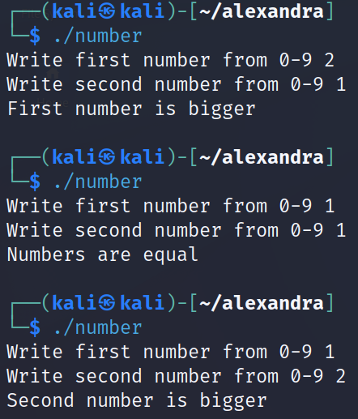

# x86program
Hello in here are my projects related in **cybersecurity**, **programming**, **exploiting**, **hacking**, etc.

# Linux x86 assembler
* **number.asm**: asks for a first number, secondly asks for a second number ; compares the two numbers and tells which one is bigger or if they are equal.
  
  

* **asknumberstack.asm**: asks for numbers until user request stop. finally, shows numbers in reverse order.


# octal and chmod


this linux command  gives different permission to different groups of users.the permission are read write and execute.abbreviated with rwx.

you need to write chmod followed by octal number equivalents to rwx

|octal   |binary   | meaning |
|---|---|---|
|0|000|---|
|1|001|--x|
|2|010|-w-| 
|3|011|-wx|
|4|100|r--|
|5|101|r-x|
|6|110|rw-|
|7|111|rwx|


Permissions are given to different users : 
- **owner**: is the creator of file 
- **group**: is the group to whom the file belongs
- **others**: all other users

For example in a school the teacher(owner) may wanna give permission to edit the file with the maths department(group) and only show it to the students(others).

The first digit is the permission for the owner, the 2nd for the group, the 3rd digit for others.

Example:
```
chmod 764 filename.tx
```
In this example :
- the teacher can read write and execute
- the department can read and write
- the students can only read

Pro-tip:
Instead of memorizing the table you only need to remember 4,2,1 as each one contain the necessary permissions (read,write,execute). Example:


You want to read(r) and execute(x) but not write you add the corresponding numbers 4 + 1 = 5 (r-x) and now have the permission.

Example : 
```
chmod 754 file 
```
Lets give the owner rwx (4+2+1) the group rx (4+1) and others r (4).  


# first x86 asm program

The first x86 asm program is coded in linux, greeting the user; within the following text will appear :
```
' Hi how are you? '
```

The first step


- You need to install the following tools into the system:
```
 sudo apt-get install nasm build essential 
```

- Each time you make a source code modification you need to execute:

```
 nasm -f elf32 hi.asm -o hi.o 
 ld -m elf_i386 hi.o -o hi 
```

- Finally execute the modified program :
```
./hi 
```
In asm language to show a text on screen you need to put on the registers the following values:

- In eax value of 4 meaning write
- In ebx value of 1 meaning standard output (screen in this case)
- In ecx msghi containing the address of the text
- In edx len_msghi the number of bytes within msghi


(Registers are a internal fast storage locations inside the micro processor,  EAX, EBX, ECX and EDX are 32-bit size.)


Here is the code for msghi and len_msghi :


We have made a separate section to create the tags for the message and the number of bytes and reserved space for it.
Resb 4 = 4 bytes reserved 

Note: When you assemble the program the tags will become an address. The tags make it easier to code for humans(in the program there is only addresses and no tags).  

Finally interruption 80h is to execute a syscall


 To finish the program you need to execute the following three lines:


- The code in detail :
```
; sudo apt-get install nasm build-essential
; nasm -f elf32 hi.asm -o hi.o
; ld -m elf_i386 hi.o -o hi
; ./hi

global _start

section .text

_start:

    mov eax, 4         ;print screen
    mov ebx, 1         ;standard output (screen)
    mov ecx, msghi     ;address of message hi
    mov edx, len_msghi ;number of bytes (msghi)
    int 80h

    mov eax, 1        ; sys_exit syscall
    mov ebx, 0        ; return 0 (success)
    int 80h

    section .data
    msghi: db 'Hi how are you? ', 0x0A
    len_msghi: equ $-msghi

    section .bss
    a resb 4
```


